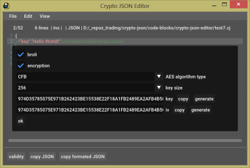

# crypto-json
C ++ library for JSON encryption with COMMENTS

## Описание

**Проект находится в разработке**

Данный проект, это редактор и библиотека, которые позволяют хранить данные JSON с комментариями в сжатом и зашифрованном виде.
Проект создан на *C++11*.

# Зачем?

Зашифрованные и сжатые файлы JSON могут быть полезны для хранения конфигураций программ, которые нужно скрыть от пользователя.
Это могут быть лицензионные ключи, параметры авторизации, языковые настройки, тексты.

## Редактор Сrypto JSON

Редактор позволяет открывать, редактировать и сохранять файлы с *JSON* структурами. Файлы могут быть *сжаты*, *зашифрованы* или сжаты и зашифрованы сразу, а так же *иметь комментарии*.
Но редактор позволяет работать и с обычными текстовыми файллами.

Программу можно найти в архиве *bin.zip*.


*Главное окно*



*Параметры кодирования файла*

## JSON с комментариями

Для очистики строковых данных, содержащих JSON данные с комментариями, используется функция:

```cpp
std::string strip_json_comments(const std::string &json_string, const bool with_whitespace = false)
````

* json_string 		-	Строка с JSON и комментариями
* with_whitespace 	- 	Флаг включает замену комментариев пробелами (за исключением символа *\n*)
* Функция вернет очищенную от комментариев строку

Реализацию функции *strip_json_comments* можно найти в файле *include\crypto-json\strip-json-comments.hpp*.
Функция *strip_json_comments* переписана с JS на С++. За основу был взяд код проекта [strip-json-comments](https://github.com/sindresorhus/strip-json-comments).

Пример кода:

```cpp
#include "../../include/crypto-json/strip-json-comments.hpp"
#include "../../include/crypto-json/utilities.hpp"

//...


std::string src;
crypto_json::load_file("test.json", src);
    
std::string dst = crypto_json::strip_json_comments(src);
std::cout << "dst:" << std::endl << dst << std::endl;

std::string dst2 = crypto_json::strip_json_comments(src, true);
std::cout << "dst2:" << std::endl << dst2 << std::endl;
```

Пример JSON с комментариями (взят от [сюда](https://github.com/spmbt/jsonComm)):

```json
//first line

	{"aaa": "qwerty",// 
	"bbb": 1234 //comment (not pure JSON syntax)
	,"ccc": true # alternative comment style
	,"dd\"d":/*multiline\\" comm\\ent*/ /*comm2\\*/null,
	"ee//e": "example of any symbols in key including inactive comments",
	"multiline1"/*: 1, //- example of multiline comments
	"multiline2": 2,
	"multiline3":= 1234,*/:[36.8,false/*,34*/,
		"/**/",[1,2,3,4,[//56789
		5,6,[[/*0*/7,{"x":/*xx*/"x"}],8]],{}]  ],
	"mayBeAnyStructure":{"a":1/**/,"b":2},
"lineEnd\\\\":"end"
}//after json

/*2nd after*/  
```

## Библиотека

Для работы с зашифрованными и сжатыми данными JSON существуют несколько функций. Пример ниже должен пояснить, как ими пользоваться:
 
```cpp
#include <crypto-json/crypto-json.hpp>

//...

/* загрузим текст из файла test.json */
std::string src;
crypto_json::load_file("test.json", src);

/* настроим тип шифрования - алгоритм AES в режиме CFB, длина ключа 256 */
crypto_json::EncryptionAlgorithmType type = crypto_json::EncryptionAlgorithmType::USE_AES_CFB_256;

/* создадим ключ и инициализирующий вектор длиной 256 */
std::array<uint8_t, 32> key;
std::array<uint8_t, 32> iv;

/* для примера, зазадим случайный ключ и инициализирующий вектор */
crypto_json::generate_key_or_iv(key);
crypto_json::generate_key_or_iv(iv);

/* преобразуем ключ и инициализирующий вектор в hex-строку и выведем на экран */
std::cout << "key:" << std::endl << crypto_json::to_hex_string(key) << std::endl;
std::cout << "iv:" << std::endl << crypto_json::to_hex_string(iv) << std::endl;

/* преобразуем hex-строку в ключ и инициализирующий вектор */
std::array<uint8_t, 32> key2;
std::array<uint8_t, 32> iv2;
crypto_json::convert_hex_string_to_byte(crypto_json::to_hex_string(key), key2);
crypto_json::convert_hex_string_to_byte(crypto_json::to_hex_string(iv), iv2);

/* зашифруем текст и сожмьем его при помощи алгоритма brotli */
std::string crypto_json_str = crypto_json::to_crypto_json(src, key, iv, type, true);

/* сравним размеры зашифрованного текста и оригинального */
std::cout << "src size:" << src.size() << std::endl;
std::cout << "crypto json size: " << crypto_json_str.size() << std::endl;

/* дешифруем crypto json */
std::string str = crypto_json::to_string(crypto_json_str, key, iv, type, true);

/* дешифруем crypto json в класс json библиотеки nlohmann/json.hpp */
nlohmann::json j = crypto_json::to_json(crypto_json_str, key, iv, type, true);
std::cout << "to json:" << std::endl << j << std::endl;
	
/* зашифруем данные класса библиотеки nlohmann/json.hpp */ 
std::string crypto_json_str2 = crypto_json::to_crypto_json(j, key, iv, type, true);
```

## Как подключить библиотеку и зависимости

Библиотека *crypto json* имеет следующие зависимости:

* Библиотека для шифрования алгоритмом AES: https://github.com/SergeyBel/AES
* Библиотека алгоритма сжатия brotli: https://github.com/google/brotli
* Библиотека оболочка для алгоритма сжатия brotli: https://github.com/NewYaroslav/brotli-hpp
* Библиотека для работы с JSON: https://github.com/nlohmann/json

Все указанные зависимости, как субмодули, добавлены в папку *lib*.
Чтобы использовать библиотеки brotli и JSON, включите макросы:

```cpp
CRYPTO_JSON_USE_BROTLI
CRYPTO_JSON_USE_NLOHMANN_JSON
```

Библиотека *crypto json* является *header-only*. Для подключения *crypto json* в свой проект просто укажите путь к файлами *crypto json* и к файлам ее зависимостей, и добавьте заголовочный файл *crypto-json/crypto-json.hpp*.
